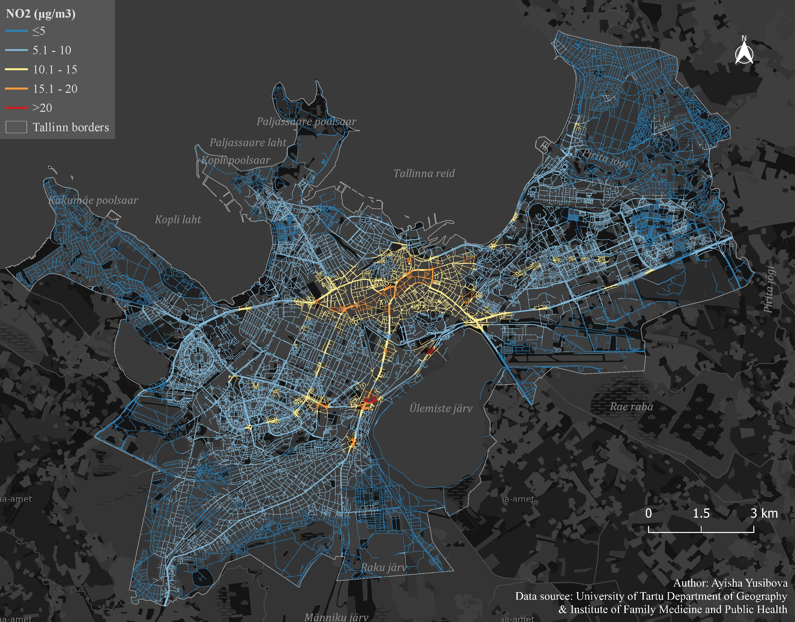

## The environmental quality of Tallinn city street network and equity of access to healthy travel environments
---

**Project description:** This is my research project at the University of Tartu Mobility Lab. The aim of the research was to map the environmental quality of Tallinn street network in terms of greenery, air pollution and noise pollution.

---

### 1. Greenery

Greenery data was obtained using remote sensing data- Sentinel2. 

---

### 2. Air pollution
Air pollution data contains PM10, PM2.5, NO2 spatial layers.

---
### PM10

### PM2.5

### NO2

### 3. Noise pollution

