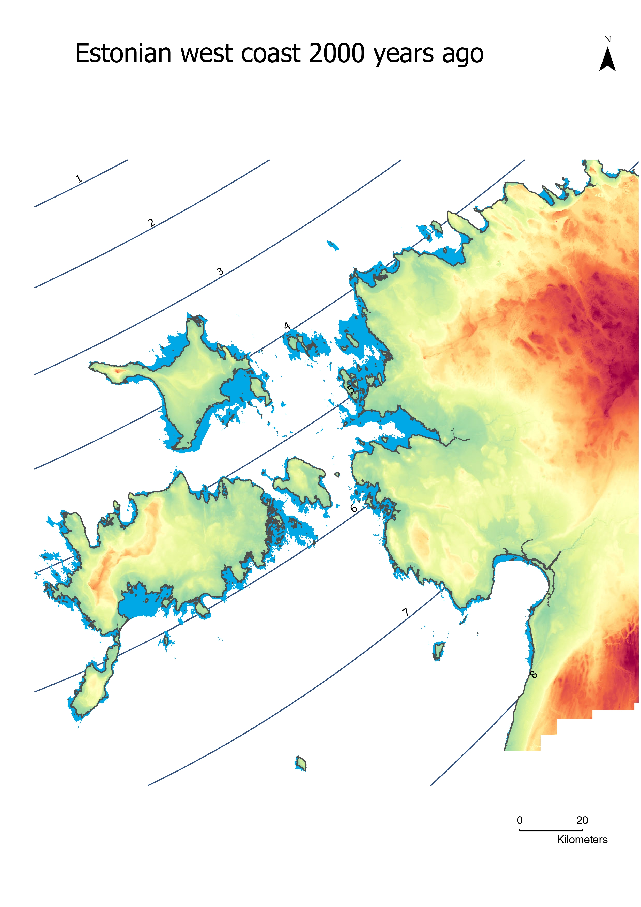
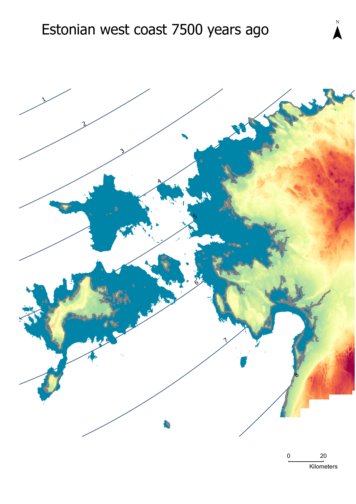
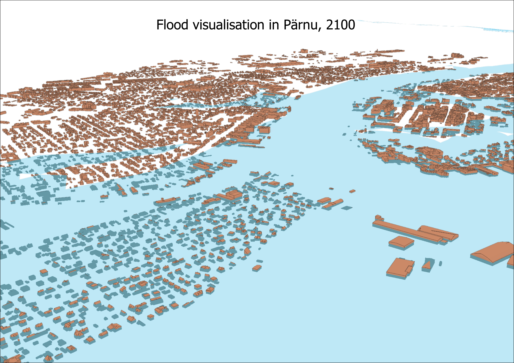
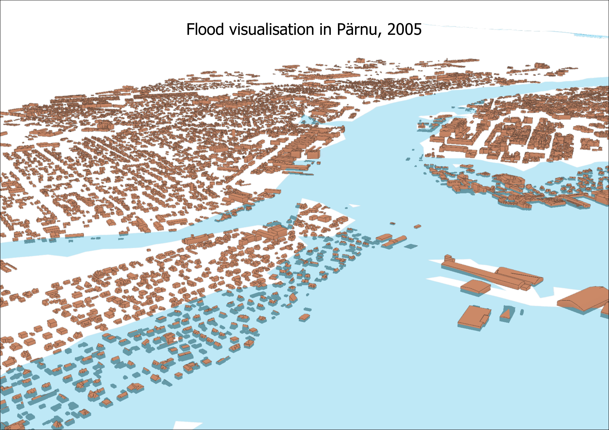

## Sea level change and flood modelling 

---
This project is one of my academic projects in the 3D modelling course. The project aimed to map sea level and predict future sea level changes. 
In this project, interpolation and raster calculation methods were used in ArcGIS Pro. 

---

---

---

---

