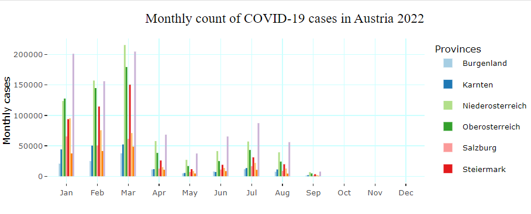
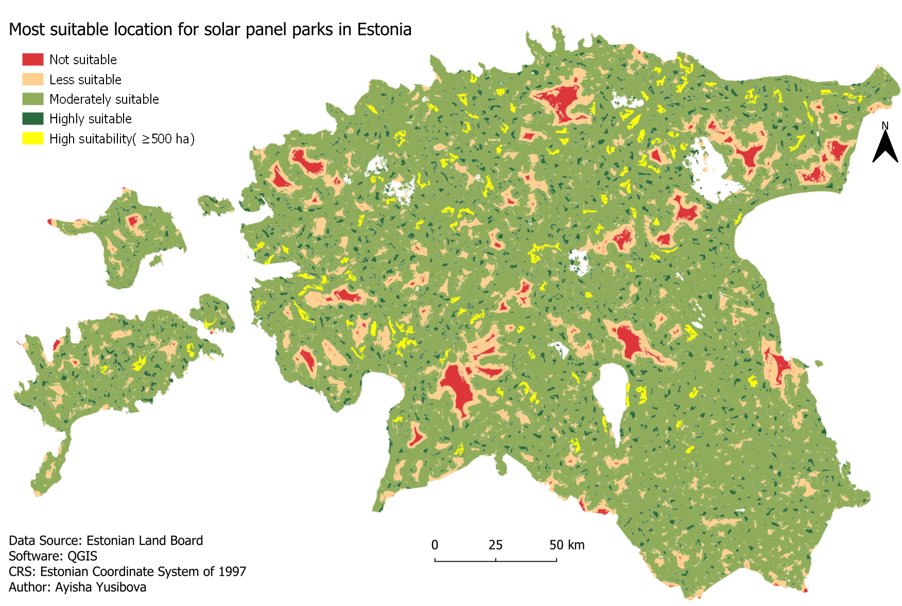
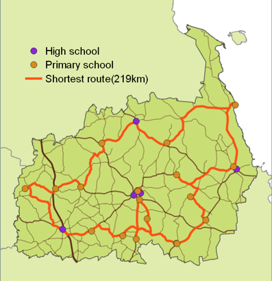
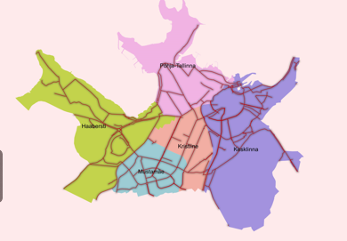
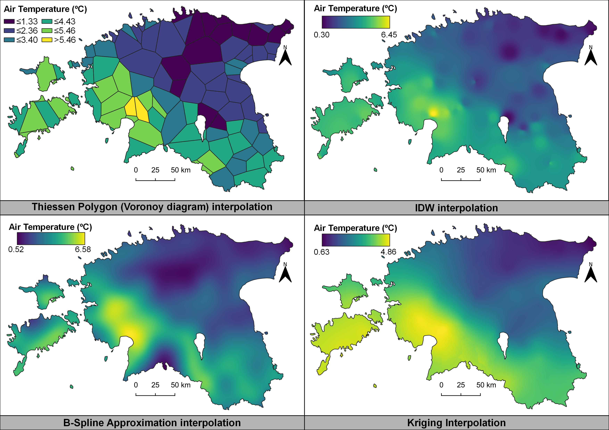

### GIS Portfolio

---

## Esri Cartography MOOC
[Hurricanes since 1851 ](images/hurricanes_since1851.png)

---
### Academic projects 

[The environmental quality of Tallin city street network and equity of access to healthy travel environments](/environmental_quality.md)

---
[Head Index calculations based on demographic, temperature and tree cover](heat_index.md).

---
[Interactive dashboard about the COVID-19 situation in Austria with R](AyishaAssignment8Final.html)

-View [Github project page](https://github.com/GeoAyisha/Covid-19-Analysis-with-Dashboards)

---
[Accessibility to greenery in Tartu](greenery_accessibility.md)

---
[Sea level changes and flood visualisation](flood_visualisation.md)

---
[Analysing mooses activity space and mobility in Estonia](moose_mobility.md)

---
[Suitability analysis for solar panels in Estonia]()

---
### Posters

[School network analysis](images/school_poster.png)

---
[Environmental quality of the cycling environment in Tallinn](images/Poster.jpg)

### Simple maps

- [Number of towers above 25m in height](images/25M_height_.png)
  
- [Slope map of Tartu pedestrian and cycling routes](images/tartu_network_slope___.png)
   
- [Air temperature visualisation Estonia with different interpolation methods](images/SmallMultiplesInterpolation.png)
   
- [Project 4 Title](README.md)
- [Project 5 Title](http://example.com/)

---

