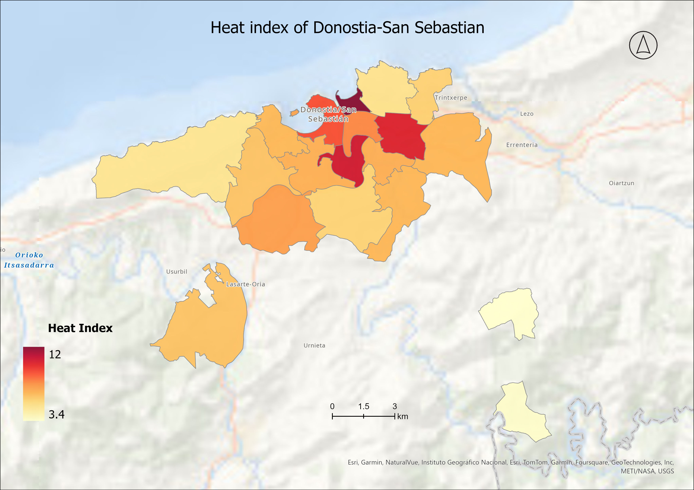

## Ayisha Portfolio

---

### Academic projects 

[The environmental quality of Tallin city street network and equity of access to healthy travel environments](/sample_page)

---
[Head Index calculations based on demographic, temperature and tree cover](/project_page)

---
[Accessibility of greenery in Tartu](/sample_page1)

---
[Analysing mooses activity space and mobility in Estonia](project_page3.md)

---
[Analysing forest fire density and affected land covers in Estonia](project_page4.md)

### Maps for fun

- [Number of towers above 25m in height](images/25M_height_.png)
  
- [Slope map of Tartu pedestrian and cycling routes](images/tartu_network_slope___.png)
  
- [Project 3 Title](http://example.com/)
- [Project 4 Title](http://example.com/)
- [Project 5 Title](http://example.com/)

---

---

Page template forked from <a href="https://github.com/evanca/quick-portfolio">evanca</a>

<!-- Remove above link if you don't want to attibute -->
