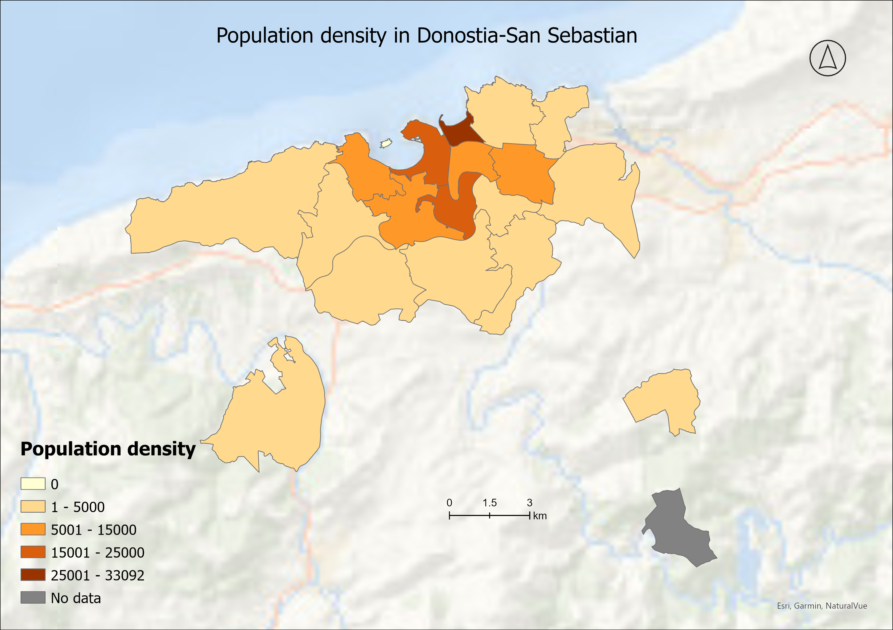
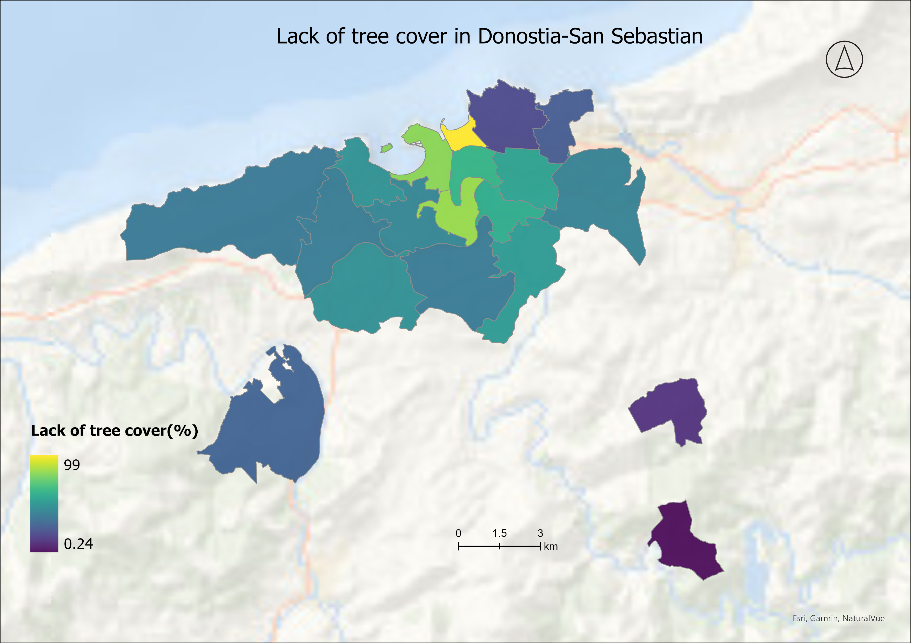
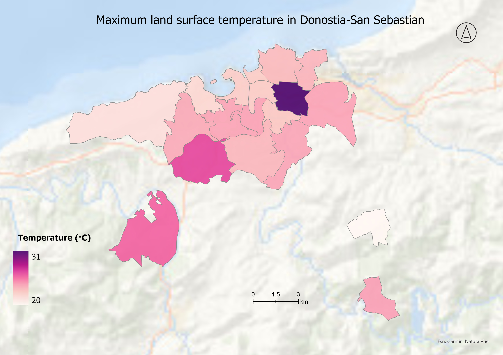

## Analysing heat index in Donostia-San Sebastian, Spain. 
---
**Project description:** This is one of my academic projects in the Esri MOOC course, where I impose the data analysis and visualization methods I have learned. The project aimed to calculate the heat index based on the lack of tree cover, max land surface temperature and population density per area unit.

**Data analysis:** The analysis was conducted in ArcGIS Pro 3.2 and QGIS. Firstly, the county data shapefile was filled with demographic data and then population density was calculated. 

In the next step, the count of tree cover cells in each area was calculated using the Zonal Statistics As Table tool. I calculated the percentage of tree canopy cover and the percentage lacking tree canopy for each postcode. 

As a Land surface temperature data maximum indicator was deduced from Esri World Living Atlas using Zonal Statistics As Table tool per each county. 

All attributes were merged into Donostia neighbourhood's shapefile data in the last step. All indicators, population density, lack of tree percentage, and maximum land surface temperature, were standardised on a scale of 1 to 5 to visualise and compare them. Next, the Heat Index was calculated by the sum of all these values in the symbology pane.

**Data Source:**Data for this project is sourced from two main providers. Land surface temperature data is extracted from the Multispectral Landsat layer available through ArcGIS Living Atlas. Tree cover data comes from the European Space Agency WorldCover 2020 Land Cover layer, which is also available through ArcGIS Living Atlas. Additionally, population data and neighbourhood shapefile are directly obtained from Donostiako Udala.

