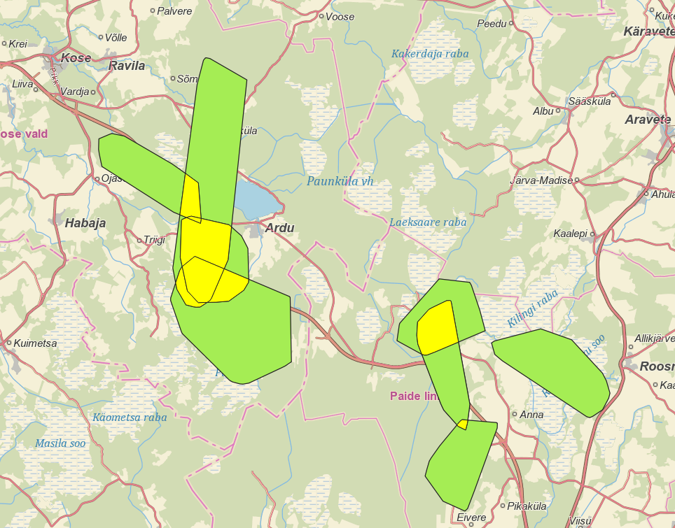

## Analysing heat index in Donostia-San Sebastian, Spain. 

**Project description:** This is one of my academic projects in the Esri MOOC course. The project aimed to calculate the heat index based on the lack of tree cover, max land surface temperature and population density per area unit.
---
**Data analyis:** The analysis was conducted in ArcGIS Pro 3.2 and QGIS. Firstly, the county data shapefile was filled with demographic data and then population density was calculated. In the next step, the count of tree cover cells in each area was calculated using the Zonal Statistics As Table tool. we calculated the percentage of tree canopy cover and the percentage lacking tree canopy for each postcode. 

---
**Data Source:**Data used in this project was provided by Geoinformatics Labs as a part of the “Study of moose mobility on road E263 TallinnTartuVõru-Luhamaa between km 40-85”  project. 

### 1. Map of activity space and mobility of mooses

### 4. Intersected activity spaces calculation

 

For more details see [GitHub Flavored Markdown](https://guides.github.com/features/mastering-markdown/).
