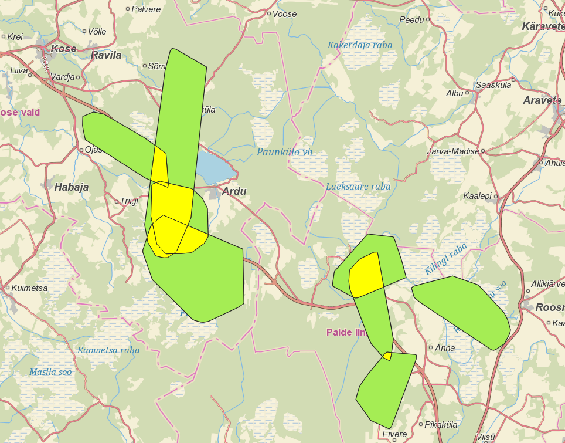

## Analysing mobility and activity spaces of mooses in Estonia

**Project description:** This is my academic project at the University of Tartu Geoinformatics Lab. The analysis aimed to calculate and visualise how much mooses’ activity spaces are overlapping. 
---
**Data analyis:** The analysis was conducted by transforming raw csv data containing GPS data from  mooses to Esri shapefile format, creating convex hulls using the Minimum Bounding Geometry tool and Basic Statistics tool. 
**Data Source:**Data used in this project was provided by Geoinformatics Labs as a part of the “Study of moose mobility on road E263 TallinnTartuVõru-Luhamaa between km 40-85”  project. 

### 1. Map of activity space and mobility of mooses

### 4. Intersected activity spaces calculation

 

For more details see [GitHub Flavored Markdown](https://guides.github.com/features/mastering-markdown/).
